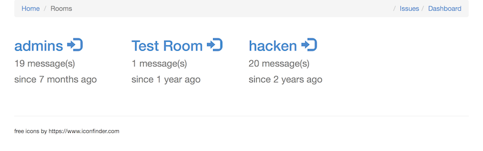
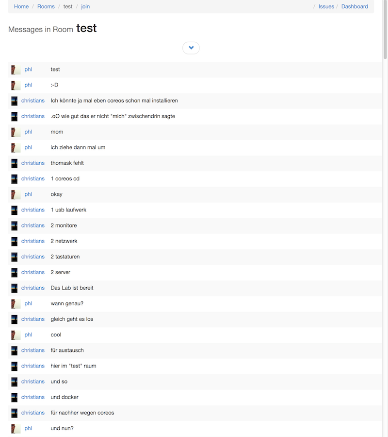
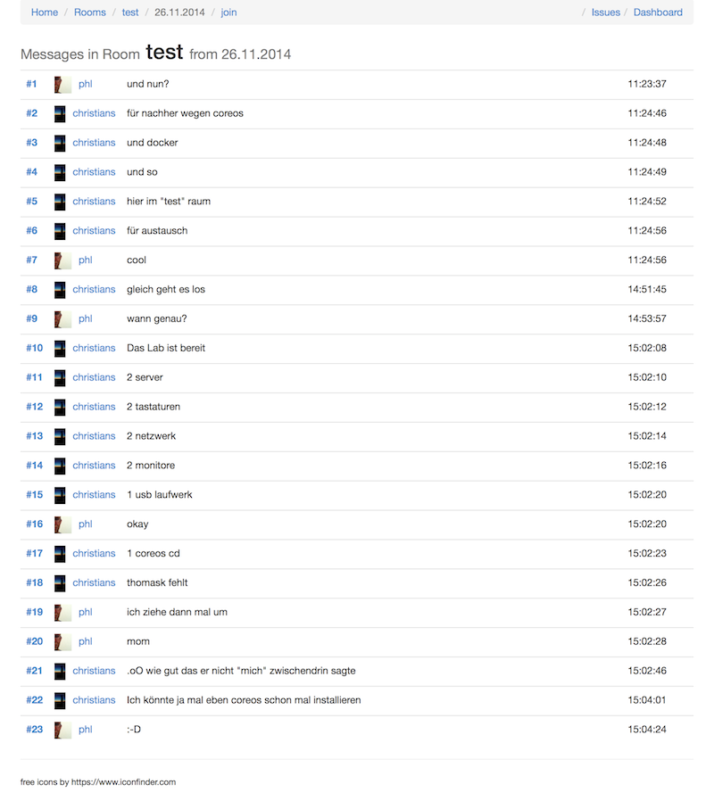

# Chat Log Server

Displays the ChatRoom History Entries from an OpenFire Jabber Server.
It uses the Tables _ofMucRoom_ and _ofMucConversationLog_ from the OpenFire Database, and needs Read Access.

### Configuration

You need to update the following line from the _conf/application.conf_

    # DB openfire
    db.openfire.driver=com.mysql.jdbc.Driver
    db.openfire.url="jdbc:mysql://127.0.0.1:3306/consolving_openfire?characterEncoding=UTF-8"
    db.openfire.user=play_openfire
    db.openfire.password="play_openfire"

## Start

    activator run
    
You could also create a package with

    activator dist
    
    
    
## Screens

### Main Dashboard

### Browse Entries

### Show all Entries of one Day  
    

Query:

    /rooms/:roomId/date/:year/:month/:day